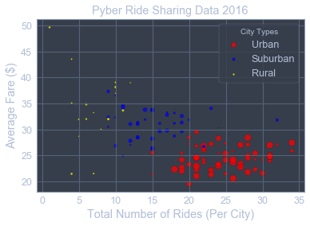
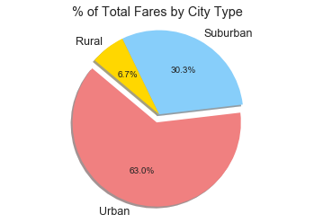
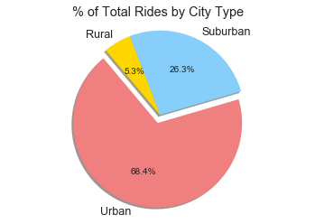
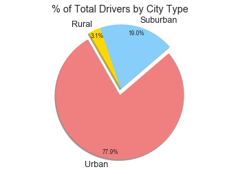

```python
#Dependencies
import pandas as pd
import matplotlib.pyplot as plt
from jupyterthemes import jtplot
import os
import numpy as np
import seaborn as sns
jtplot.style(theme='onedork')
import matplotlib
```


```python
#File Paths
citydata = os.path.join("Resources", "city_data.csv")
ridedata = os.path.join("Resources", "ride_data.csv")
#One dataframe for each csv
citydatadf = pd.read_csv(citydata, encoding="ISO-8859-1")
ridedatadf = pd.read_csv(ridedata, encoding="ISO-8859-1")
#Test of city data frame
testdf = citydatadf.loc[citydatadf["city"] == "Sarabury",:]
testdf
```


<div>
<style scoped>
    .dataframe tbody tr th:only-of-type {
        vertical-align: middle;
    }

    .dataframe tbody tr th {
        vertical-align: top;
    }

    .dataframe thead th {
        text-align: right;
    }
</style>
<table border="1" class="dataframe">
  <thead>
    <tr style="text-align: right;">
      <th></th>
      <th>city</th>
      <th>driver_count</th>
      <th>type</th>
    </tr>
  </thead>
  <tbody>
    <tr>
      <th>19</th>
      <td>Sarabury</td>
      <td>46</td>
      <td>Urban</td>
    </tr>
  </tbody>
</table>
</div>


```python
#Add driver count and type columns to the ride dataframe
ridedatadf['driver_count'] = citydatadf['driver_count']
ridedatadf['type'] = citydatadf['type']
#Set this combined dataframe to an entry that is easier to type
df = ridedatadf
```


```python
#Create a blank dataframe with labeled columns
cdf = pd.DataFrame(columns=["city","driver_count", "number_of_rides", "average_fare", "type"])
#Iterate through all cities in the dataframe created above
#In this for loop each iteration creates one line for a city that has all of the information we need to make all of the graphs
#This for statement does creat duplicate cities with identical data
for city in df['city']:
    #Create a Dataframe corresponding to all rides for a given city
    citydf = df.loc[df['city'] == city, :]
    #The number of rides is the number of fares collected for a given city
    number_of_rides = len(citydf['fare'])
    #average fare is sum of all fares divided by number of fares
    average_fare = citydf['fare'].sum()/number_of_rides
    #Get driver count for the given city from the original citydata frame because the driver count is more likely to be correct
    #The type data column had some errors in the combined frame because of different dataframe lengths
    #Since I had to take type data from the city dataframe I decided to also take the driver count directly from the source
    driver_count = citydatadf.loc[citydatadf['city'] == city, 'driver_count']
    citytype = citydatadf.loc[citydatadf['city'] == city, 'type']
    #Create a dictionary of the values found for the given city
    citydict = {
        "city": city,
        "number_of_rides": number_of_rides,
        "average_fare": average_fare,
        "driver_count": driver_count,
        "type": citytype
    }
    #Turn this dictionary into a dataframe with one row
    row_frame = pd.DataFrame(citydict)
    #organize this frame so that the columns on both dataframes are in order and identical
    organized_row_frame = row_frame[["city","driver_count", "number_of_rides", "average_fare", "type"]]
    #append the row for the individual city to the frame
    cdf = cdf.append(organized_row_frame)
#Drop duplicate city values so that there is only one entry per city
cdf = cdf.drop_duplicates(subset='city')
#add a column to cdf called total fares which is equal to number_of_rides*average_fare so we will have the data for pie chart #1
cdf['total_fare'] = cdf['number_of_rides']*cdf['average_fare']
cdf.head()
```


<div>
<style scoped>
    .dataframe tbody tr th:only-of-type {
        vertical-align: middle;
    }

    .dataframe tbody tr th {
        vertical-align: top;
    }

    .dataframe thead th {
        text-align: right;
    }
</style>
<table border="1" class="dataframe">
  <thead>
    <tr style="text-align: right;">
      <th></th>
      <th>city</th>
      <th>driver_count</th>
      <th>number_of_rides</th>
      <th>average_fare</th>
      <th>type</th>
      <th>total_fare</th>
    </tr>
  </thead>
  <tbody>
    <tr>
      <th>19</th>
      <td>Sarabury</td>
      <td>46</td>
      <td>27</td>
      <td>23.490000</td>
      <td>Urban</td>
      <td>634.23</td>
    </tr>
    <tr>
      <th>44</th>
      <td>South Roy</td>
      <td>35</td>
      <td>22</td>
      <td>26.031364</td>
      <td>Urban</td>
      <td>572.69</td>
    </tr>
    <tr>
      <th>32</th>
      <td>Wiseborough</td>
      <td>55</td>
      <td>19</td>
      <td>22.676842</td>
      <td>Urban</td>
      <td>430.86</td>
    </tr>
    <tr>
      <th>36</th>
      <td>Spencertown</td>
      <td>68</td>
      <td>26</td>
      <td>23.681154</td>
      <td>Urban</td>
      <td>615.71</td>
    </tr>
    <tr>
      <th>1</th>
      <td>Nguyenbury</td>
      <td>8</td>
      <td>26</td>
      <td>25.899615</td>
      <td>Urban</td>
      <td>673.39</td>
    </tr>
  </tbody>
</table>
</div>


```python
#Create three dataframes that represent the data sorted by city type
ruraldf = cdf.loc[cdf['type'] == "Rural", :]
suburbandf = cdf.loc[cdf['type'] == "Suburban", :]
urbandf = cdf.loc[cdf['type'] == "Urban", :]
#Cast Driver Count as a float so it can be used as a size argument for pyplot.scatter in the next cell
urbandf['driver_count'] = urbandf['driver_count'].astype(float)
suburbandf['driver_count'] = suburbandf['driver_count'].astype(float)
ruraldf['driver_count'] = ruraldf['driver_count'].astype(float)
```

    C:\Users\rwzlo\AppData\Local\conda\conda\envs\PythonData\lib\site-packages\ipykernel\__main__.py:6: SettingWithCopyWarning: 
    A value is trying to be set on a copy of a slice from a DataFrame.
    Try using .loc[row_indexer,col_indexer] = value instead
    
    See the caveats in the documentation: http://pandas.pydata.org/pandas-docs/stable/indexing.html#indexing-view-versus-copy
    C:\Users\rwzlo\AppData\Local\conda\conda\envs\PythonData\lib\site-packages\ipykernel\__main__.py:7: SettingWithCopyWarning: 
    A value is trying to be set on a copy of a slice from a DataFrame.
    Try using .loc[row_indexer,col_indexer] = value instead
    
    See the caveats in the documentation: http://pandas.pydata.org/pandas-docs/stable/indexing.html#indexing-view-versus-copy
    C:\Users\rwzlo\AppData\Local\conda\conda\envs\PythonData\lib\site-packages\ipykernel\__main__.py:8: SettingWithCopyWarning: 
    A value is trying to be set on a copy of a slice from a DataFrame.
    Try using .loc[row_indexer,col_indexer] = value instead
    
    See the caveats in the documentation: http://pandas.pydata.org/pandas-docs/stable/indexing.html#indexing-view-versus-copy
    


```python
#Create three scatters corresponding to the urban suburban and rural city types
#plot number of rides and average fare by city type, set size to the number of drivers
plt.scatter(urbandf['number_of_rides'], urbandf['average_fare'], marker="o", facecolors="red", edgecolors="black",
            s=urbandf['driver_count'], alpha=0.75, label="Urban")
plt.scatter(suburbandf['number_of_rides'], suburbandf['average_fare'], marker="o", facecolors="blue", edgecolors="black",
            s=suburbandf['driver_count'], alpha=0.75, label="Suburban")
plt.scatter(ruraldf['number_of_rides'], ruraldf['average_fare'], marker="o", facecolors="yellow", edgecolors="black",
            s=ruraldf['driver_count'], alpha=0.75, label="Rural")
#Add Title, Axes Titles, and Legend to plot
plt.title("Pyber Ride Sharing Data 2016")
plt.xlabel("Total Number of Rides (Per City)")
plt.ylabel("Average Fare ($)")
plt.legend(loc="upper right", title="City Types")
#plt.grid() provided for others who use a different Jupyter Notebook format. My theme provides the grid by default.
#plt.grid()
plt.show()
```





```python
#Fare data for first pie chart
urbantotalfare = urbandf['total_fare'].sum()
suburbantotalfare = suburbandf['total_fare'].sum()
ruraltotalfare = ruraldf['total_fare'].sum()
farelist = [urbantotalfare, suburbantotalfare, ruraltotalfare]
#Ride data for second pie chart
urbanrides = urbandf['number_of_rides'].sum()
suburbanrides = suburbandf['number_of_rides'].sum()
ruralrides = ruraldf['number_of_rides'].sum()
ridelist = [urbanrides, suburbanrides, ruralrides]
#Driver data for third pie chart
urbandrivers = urbandf['driver_count'].sum()
suburbandrivers = suburbandf['driver_count'].sum()
ruraldrivers = ruraldf['driver_count'].sum()
driverlist = [urbandrivers, suburbandrivers, ruraldrivers]
#Labels to use for all three pie charts
labels = ["Urban", "Suburban", "Rural"]
#Explode value to use for all three pie charts 
explode = (0.1, 0, 0)
#Changes the default colors because I defined my lists in a different order than the example provided
colors = ['lightcoral', 'lightskyblue', 'gold']
#Sets default font to black (I use a different Jupyter theme so I had to modify this to be able to see percentages.)
#It should have no effect for a Jupyter Notebook that uses the base settings
matplotlib.rcParams['text.color'] = 'k'
```


```python
#Create first pie chart subject to constraints created above
plt.pie(farelist, explode=explode, labels=labels, colors=colors,
        autopct="%1.1f%%", shadow=True, startangle=140)
plt.title("% of Total Fares by City Type")
plt.axis("equal")
plt.show()
```





```python
#Create second pie chart subject to constraints created above
plt.pie(ridelist, explode=explode, labels=labels, colors=colors,
        autopct="%1.1f%%", shadow=True, startangle=130)
plt.title("% of Total Rides by City Type")
plt.axis("equal")
plt.show()
```





```python
#Create third pie chart from the data above
matplotlib.rcParams['font.size'] = 8.4
plt.pie(driverlist, explode=explode, labels=labels, colors=colors,
        autopct="%1.1f%%", pctdistance=0.90, shadow=True, startangle=120)
plt.title("% of Total Drivers by City Type")
plt.axis("equal")
plt.show()
```





```python
#Three Observable Trends
# 1. Urban areas have a higher drivers to rides given ratio : each urban driver has less rides that they can give
# 2. Urban areas have many more rides but not a much higher fare sum, indicating that rides are shorter in urban areas
# 3. Rural areas have a very small percentage of drivers but much higher fare and ride percentage. Indicating that there aren't many drivers but 
# each driver gives many long rides that have high fares.
```
